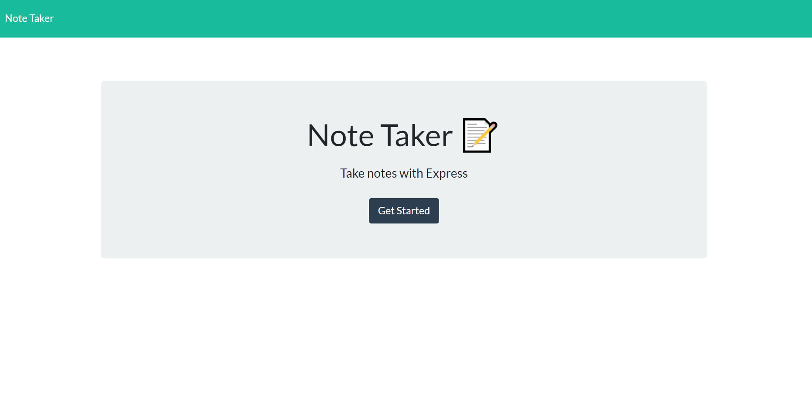
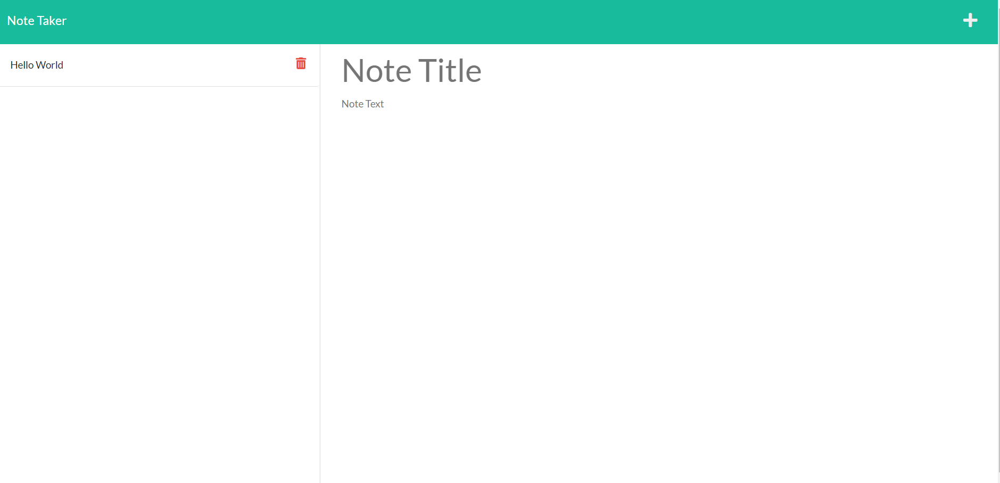

# Note Taker

## Description

A note taking app that utilizes a 'notes' API to display a list of notes.

## Screenshots

## Installation

- Navigate to the correct directory in your console 
- Run 'npm i' to install the required Node.js packages 

## Usage

- In the root directory run 'node server'
- Open your browser to 'localhost:3301'

## Website
https://swvmpdad-note-taker.herokuapp.com/

Made by William Campbell.
Find me on GitHub @ [swvmpdad](https://github.com/swvmpdad)
